# Lantern & Leaf | Lighthouse Tea Room

> Evening tasting flights at the lighthouse.

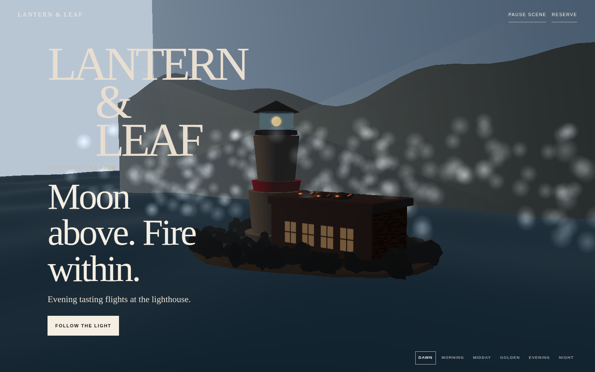

## Overview

**Lantern & Leaf** is an interactive, single-file web experience for a coastal lighthouse tea room located at Breakwater Point. Built with inline HTML, CSS, and JavaScript, the site features a fixed 3D visual stage positioned behind six story panels. As the user scrolls down the page, the environment dynamically transitions across six chronological moments of the day:

1. **Dawn** – Soft morning mist and distant horizon under cold morning skies.
2. **Morning** – Clear, bright daylight bringing out the metallic luster of copper kettles.
3. **Midday** – High-noon sunlight showcasing the tasting menu over clear tide waters.
4. **Golden Hour** – Warm sunset glow softening the coastal rocks and tea shop.
5. **Evening** – Twilight mood with glowing shop windows and steam rising from kettles.
6. **Night** – Deep starry skies with a sweeping lighthouse beam guiding visitors.

---

## Quick Start

### Running Locally

1. **Direct File Open:** You can open `index.html` directly in any WebGL2-compatible web browser.
2. **Static Web Server:** For best performance and proper module loading, serve the repository root with a local static HTTP server:
   ```bash
   python3 -m http.server 8080
   ```
   Then navigate to `http://localhost:8080` in your browser.

### Network Requirements
The application relies on external Content Delivery Networks (CDNs) for static styles and runtime libraries:
- **Tailwind CSS v4** (Browser Build) via jsDelivr
- **GSAP 3.12.5 & ScrollTrigger** via unpkg
- **Lenis 1.1.18** via unpkg
- **Three.js 0.170.0** (ES Module) via unpkg

An active internet connection is required on initial load to fetch these dependencies.

---

## Section Walkthrough

### 1. Dawn (`#dawn`)


*“Moon above. Fire within. Evening tasting flights at the lighthouse.”*
The experience begins at twilight as morning light breaks across the horizon. Soft fog rolls over the water while the lighthouse beam turns slowly in the early morning air.

### 2. Morning (`#morning`)
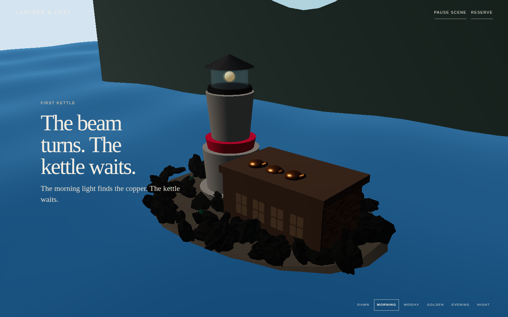

*“The beam turns. The kettle waits. The morning light finds the copper.”*
As morning arrives, bright clear skies illuminate the tea shop building and stone foundation, highlighting three copper kettles sitting ready on the counter.

### 3. Midday (`#midday`)
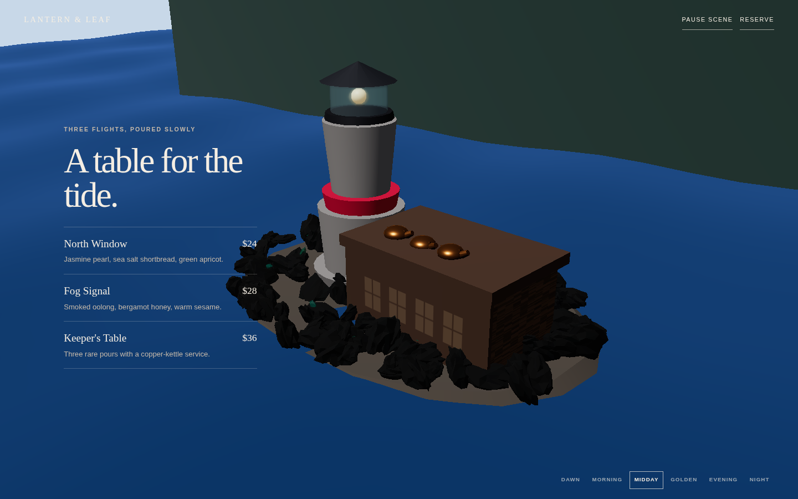

*“A table for the tide.”*
High-noon daylight floods the coastal scene, presenting three tasting flight offerings: *North Window* ($24), *Fog Signal* ($28), and *Keeper's Table* ($36).

### 4. Golden Hour (`#golden`)
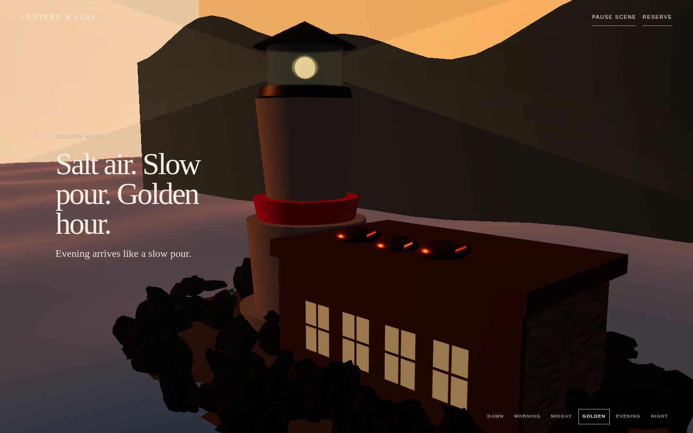

*“Salt air. Slow pour. Golden hour. Evening arrives like a slow pour.”*
Warm golden hour tones wash over the tea shop and ocean. Scrolling slowly through this section reveals the hidden Keeper's Log button.

### 5. Evening (`#evening`)
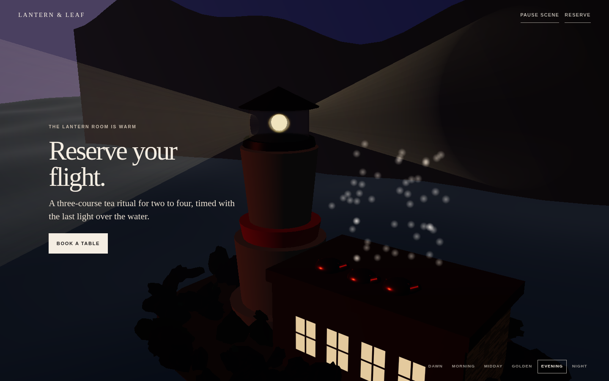

*“Reserve your flight. A three-course tea ritual for two to four, timed with the last light over the water.”*
Dusk falls over Breakwater Point. Warm light glows through the tea shop windows, steam begins rising from the copper kettles, and visitors are invited to book a table.

### 6. Night (`#night`)
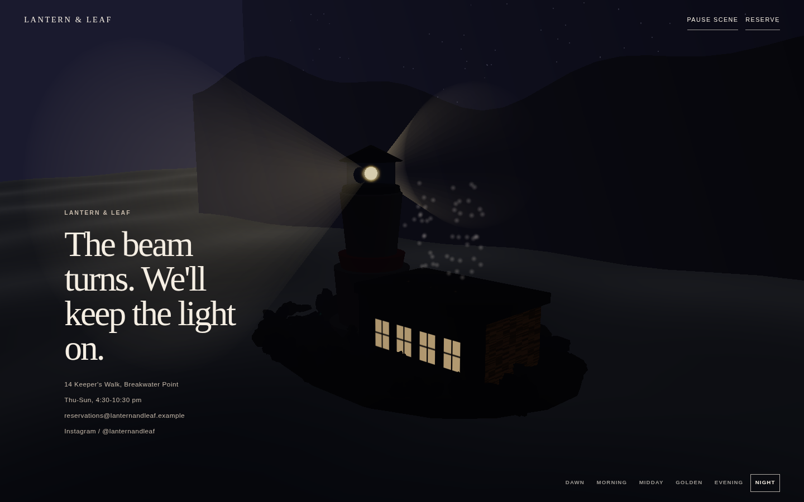

*“The beam turns. We'll keep the light on.”*
Deep night settles over the lighthouse under a blanket of stars. Details for hours of operation (Thu–Sun, 4:30–10:30 pm) and address (14 Keeper's Walk) are displayed alongside contact links.

---

### Interactive Dialogs

#### Keeper's Log
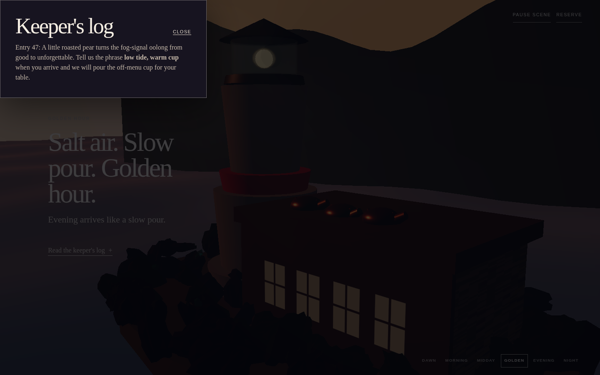

Revealed after slowing down in the Golden Hour section, this dialog presents Entry 47 from the lighthouse keeper: *"Tell us the phrase **low tide, warm cup** when you arrive and we will pour the off-menu cup for your table."*

#### Reservation Dialog
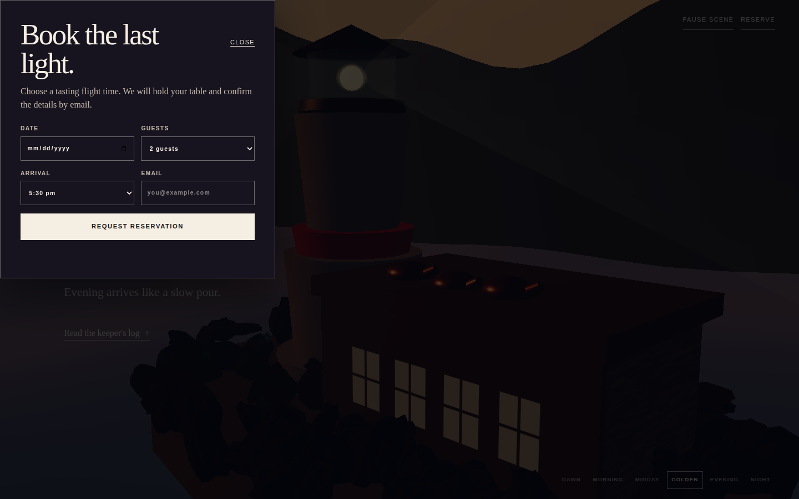

Opened via the "Reserve" or "Book a table" buttons. Provides a reservation form requesting Date, Party Size (Guests), Arrival Time, and Email address.

---

### Responsive & Accessibility Views

#### Mobile View
| Mobile Dawn | Mobile Golden Hour |
| :---: | :---: |
| 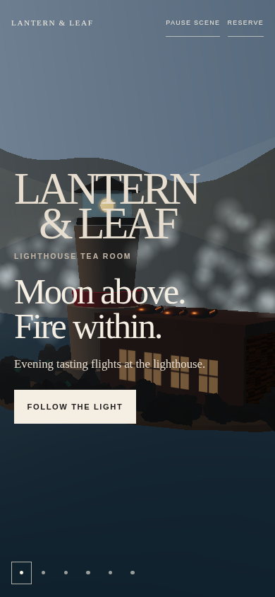 | 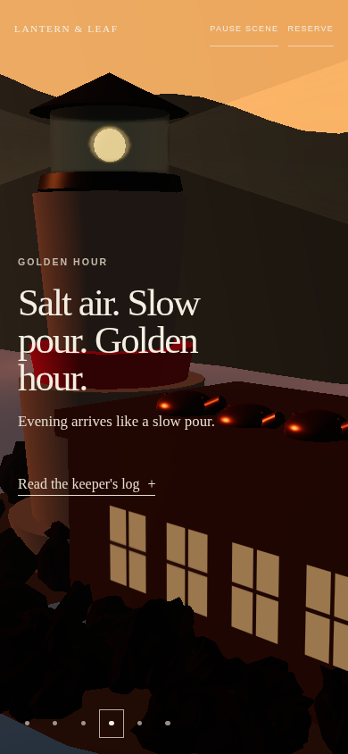 |

At viewports $\le 700\text{px}$, typography scales down, layout margins adjust, and moment navigation compresses into clean circular indicators.

#### Reduced Motion View
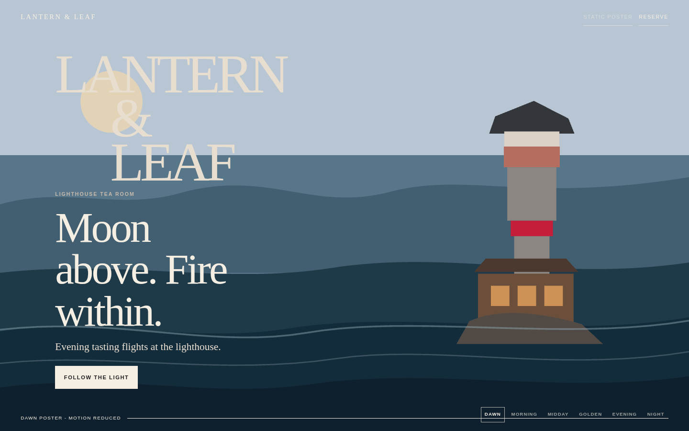

When `prefers-reduced-motion: reduce` is enabled, 3D WebGL rendering and smooth scrolling are completely bypassed. The site renders a clean, static SVG vector poster while maintaining full text content accessibility and native scroll activation.

---

## Architecture Overview

```
                      +------------------------------------+
                      |            User Scroll             |
                      +------------------------------------+
                                         |
                                         v
                      +------------------------------------+
                      |         Lenis Smooth Scroll        |
                      +------------------------------------+
                                         |
                                         v
                      +------------------------------------+
                      |       GSAP ScrollTrigger           |
                      |  Master Timeline Scrub (0.0 - 1.0) |
                      +------------------------------------+
                                         |
                                         v
                      +------------------------------------+
                      |      Interpolate Moments Table     |
                      |  (Lighting, Fog, Colors, Particles)  |
                      +------------------------------------+
                                         |
                                         v
                      +------------------------------------+
                      |     Evaluate 3D Camera Curve       |
                      +------------------------------------+
                                         |
                                         v
                      +------------------------------------+
                      |    Three.js WebGL Render Loop      |
                      +------------------------------------+
```

### 1. Page Structure
- **Fixed Visual Stage (`#visual-stage`):** Pinned at `z-index: 0` behind story panels. Contains a fallback SVG vector poster (`.poster`) and the WebGL canvas (`#scene-canvas`).
- **Story Panels (`<main id="story">`):** Six full-height `<section>` story panels (`.story-panel`) containing hero copy, flight menus, and reservation buttons.
- **Header & Navigation:** Fixed top header (`.site-header`) with wordmark, pause toggle, and reservation trigger; fixed bottom-right moment jump bar (`.moment-nav`); fixed bottom loading indicator (`.loading-status`).

### 2. Boot and Fallback Logic
The application evaluates system capabilities sequentially during initialization:
1. **Reduced Motion Check:** `window.matchMedia('(prefers-reduced-motion: reduce)').matches` triggers static poster mode (`preparePosterOnly`).
2. **WebGL2 Support:** Requests a `webgl2` context on the canvas. If unavailable, falls back to `preparePosterOnly`.
3. **CDN Library Check:** Confirms `window.gsap`, `window.ScrollTrigger`, and `window.Lenis` are present in global scope.
4. **Dynamic Module Import:** Dynamically imports Three.js ESM from unpkg (`import(THREE_URL)`). If import fails, falls back.
5. **Context Loss Handling:** Attaches a `webglcontextlost` event listener on the canvas to gracefully fall back to the vector SVG poster if GPU context is lost.

### 3. Scroll Pipeline
- **Lenis Smooth Scroll:** Provides momentum-based smooth scrolling (`lerp: 0.08`, `syncTouch: true`).
- **GSAP ScrollTrigger Sync:** Lenis `raf` execution is driven directly by `gsap.ticker`. Scroll updates trigger `ScrollTrigger.update`.
- **Master Progress Scrub:** GSAP ScrollTrigger creates a scrubbed timeline spanning `#story` height, animating a `masterProgress` variable from `0` to `1`.
- **Moment Activation:** `getMomentIndex()` calculates the active story panel from scroll progress boundaries `[0.15, 0.3, 0.5, 0.7, 0.85]`, applying `.is-active` class to panel elements and updating `aria-current` on moment buttons.

### 4. Scene State & Transition Matrix
Every dynamic aspect of the 3D scene is driven by a six-state configuration matrix (`moments` array):
- **Visual Parameters:** Sky color, fog color & density, key light color/intensity/position, ambient & hemisphere lighting, lighthouse beam intensity, window glow, ocean color, particle opacity thresholds (mist, steam, stars), and tone mapping exposure.
- **Interpolation & Easing:** Moments are interpolated across defined scroll boundaries using smoothstep and custom cubic-bezier easing functions (`cinematicSilk` and `cinematicFlow`).
- **Camera Path:** Camera position and target look-at vectors are generated by sampling 3D `CatmullRomCurve3` splines mapped to scroll progress.

### 5. Scene Contents & Procedural Assets
- **Procedural Geometry:** Lighthouse tower composed of layered cylinders (base, body, red stripe, lantern base, glass room, and cone roof); faceted rocks generated via dodecahedron geometry perturbed by sine function displacements; sea glass pieces (`IcosahedronGeometry`).
- **Custom Wood Shader:** Custom GLSL `ShaderMaterial` on the tea shop body generating 2D hash noise and procedural wood grain texture modulated by vertex light direction.
- **Custom Ocean Shader:** GLSL `ShaderMaterial` with vertex wave displacement (sine/cosine functions) and Fresnel specular water reflection.
- **Textures:** Canvas-generated 2D radial gradient textures for soft drop shadows (`createRadialTexture`) and window pane alpha maps (`createWindowAlphaTexture`).
- **Particle Systems:** Three `THREE.Points` particle instances:
  - *Mist:* Low-lying coastal fog drifting along sine loops.
  - *Steam:* Warm particles rising vertically from tea shop copper kettles.
  - *Stars:* Distant background stars appearing in evening/night skies.

### 6. Interaction and Business Layer
- **Pause Control (`#pause-scene`):** Toggles `scenePaused` state. Pauses particle animation and lighthouse beam rotation while maintaining scroll navigation.
- **Moment Jump Navigation:** Clicking any nav button (`data-jump="0..5"`) invokes `lenis.scrollTo()` to smoothly animate directly to the target section.
- **Keeper's Log Easter Egg:** Monitors scroll velocity via Lenis scroll events. If velocity stays below `0.35` while scrolling through Golden Hour (`0.5 < progress < 0.7`), a timer reveals the Keeper's Log button after 650ms.
- **Reservation Form:** Native HTML `<dialog>` element containing a reservation form. Submitting the form intercepts `submit`, prevents page reload, reads the requested date, and updates `#form-message` text inline.

---

## Tech Stack

| Dependency | Version / Source | Description |
| :--- | :--- | :--- |
| **Three.js** | `0.170.0` (unpkg ESM) | WebGL 3D rendering engine |
| **GSAP** | `3.12.5` (unpkg) | Animation engine and timeline driver |
| **ScrollTrigger** | `3.12.5` (unpkg) | Scroll-driven timeline plugin |
| **Lenis** | `1.1.18` (unpkg) | Smooth scroll momentum engine |
| **Tailwind CSS** | `v4` Browser Build (jsDelivr) | Utility-first styling framework |

---

## Performance and Accessibility

### Code-Verified Performance Features
- **Pixel Ratio Cap:** Capped at `Math.min(window.devicePixelRatio || 1, 2)` to prevent excessive GPU load on High-DPI screens.
- **Mobile Antialiasing Off:** WebGL antialiasing disabled on mobile devices (`max-width: 700px` or coarse pointer) for performance optimization.
- **Shadow Maps Disabled:** Dynamic shadow mapping (`renderer.shadowMap.enabled = false`) is explicitly disabled; fake drop shadows are rendered using efficient radial alpha quad meshes.
- **Particle Optimization:** Particle counts scaled down on mobile devices (mist: 150 vs 200, steam: 40 vs 50, stars: 200 vs 300).
- **Tone Mapping:** `ACESFilmicToneMapping` with exposure dynamic blending for soft color balance without expensive post-processing passes.

### Code-Verified Accessibility Features
- **Reduced Motion Poster:** Native `prefers-reduced-motion: reduce` detection completely bypasses WebGL initialization and replaces 3D rendering with a lightweight SVG vector poster.
- **Native HTML Dialogs:** Modal dialogs (`#log-dialog`, `#reservation-dialog`) use standard `<dialog>` HTML elements with keyboard accessibility and backdrop blur support.
- **ARIA Attributes:** Full ARIA labeling including `role="img"` and descriptive `aria-label` on canvas, `aria-current` on active moment navigation buttons, `aria-pressed` on scene pause control, and `aria-live="polite"` on the initial loading indicator.

---

## Known Limitations

- **Frontend-Only Form:** The reservation form processes input purely on the client side, updating DOM text in `#form-message` without sending backend network requests.
- **Placeholder Contact Email:** The contact link uses `reservations@lanternandleaf.example`, an example domain placeholder.
- **Anchor Navigation:** The Instagram footer link points to `#dawn` anchor within the page rather than an external social media profile.
- **CDN Dependencies:** The application relies entirely on external CDN availability for CSS and JS asset delivery.

---

## Project Structure

```
.
├── index.html
├── docs/
│   └── screenshots/
│       ├── 01-dawn.png
│       ├── 02-morning.png
│       ├── 03-midday.png
│       ├── 04-golden.png
│       ├── 05-evening.png
│       ├── 06-night.png
│       ├── 07-keepers-log.png
│       ├── 08-reservation-dialog.png
│       ├── 09-mobile-dawn.png
│       ├── 10-mobile-golden.png
│       └── 11-reduced-motion-poster.png
└── README.md
```

---

## License

This project is open source and available under the [MIT License](LICENSE).
